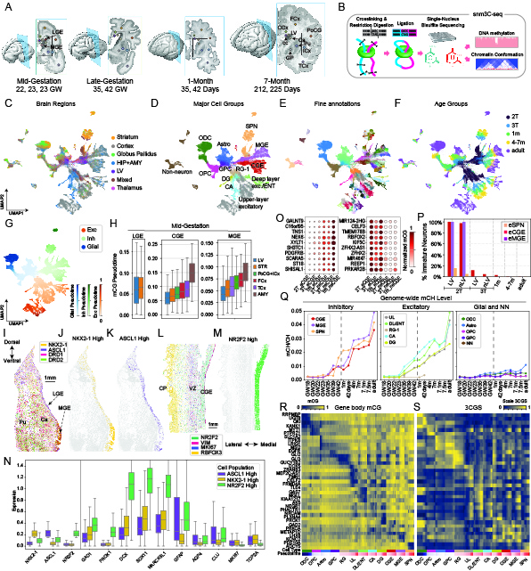

# 2026_BasalGanglia_m3C
Analysis and figure generating code and notebooks associated with the 2026 biorxiv preprint,   
"**A Single-Cell and Spatial 3D Multi-omic Atlas of Developing Human Basal Ganglia and Inhibitory Neurons**"  
https://www.biorxiv.org/content/10.64898/2026.01.28.702385v1

